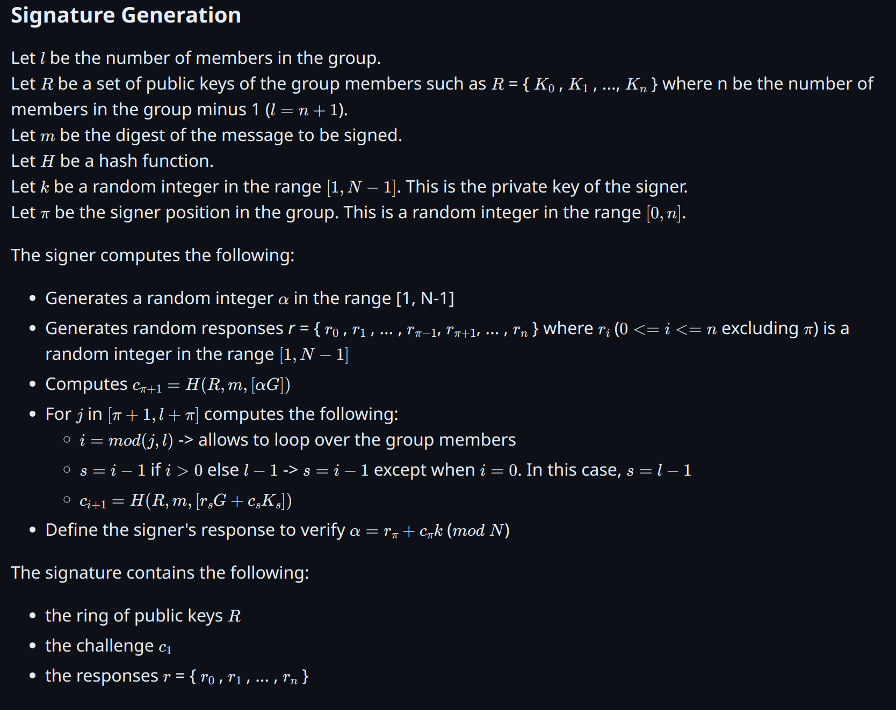
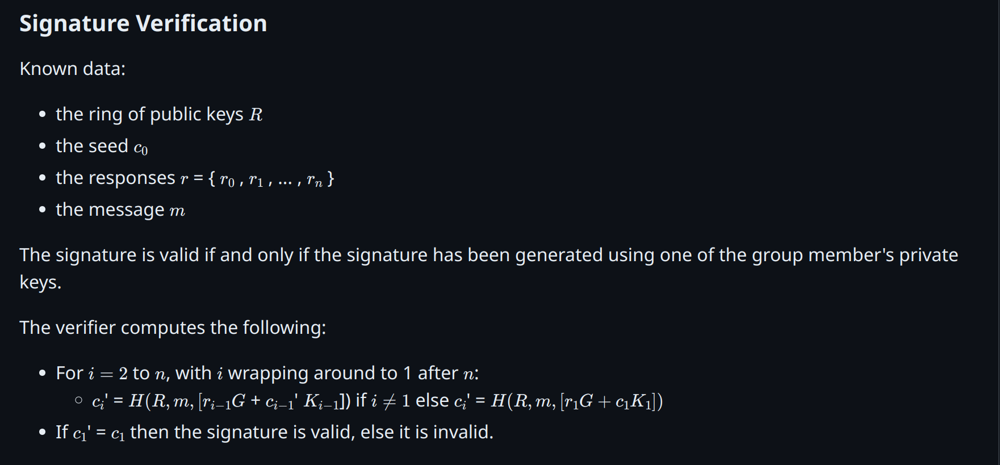

## What are Ring Signatures

Ring signatures are a type of digital signature that allows a group of users to sign a message anonymously. Unlike traditional digital signatures uniquely linked to one user, ring signatures obscure the actual author by linking multiple possible signers together in a "ring."

### Spontaneous Anonymous Group (SAG) Signatures

Spontaneous Anonymous Group (SAG) signatures, often referred to as ring signatures, are cryptographic methods that provide anonymity and spontaneity without the need for a trusted setup or coordination among group members. This makes them scalable and secure for larger groups.

#### Group Setup

When setting up a group for cryptographic purposes, such as for a Spontaneous Anonymous Group (SAG) signature scheme, there are two primary methods to establish the group members' public keys:

- **Using existing public keys** of the members from publicly available data such as blockchains. This method is suitable for scenarios where the group members have a common characteristic, such as being part of the same organization or having a specific role. For example, a group of members of a company's board of directors can be identified by their public keys, which are publicly available on the company's website.
- **Using a group key generation algorithm** to generate the public keys of the members. This method is suitable for scenarios where the group members are not known in advance, such as in a voting system. For example, a group of voters can be identified by their public keys, which are generated by the voting system's key generation algorithm.

### Back’s Linkable Spontaneous Anonymous Group (bLSAG) Signatures

Linkable Spontaneous Anonymous Group (LSAG) signatures build on the concept of SAG by adding the property of linkability. This is crucial for applications like blockchain where preventing double-spending is essential.

#### Properties of LSAG Signatures

1. **Signer Ambiguity**
   - An observer can determine that the signer is a member of the ring but cannot identify which member. This obfuscation helps protect the origin of transactions, as used in Monero to obscure the source of funds.

2. **Linkability**
   - If a private key is used to sign two different messages, the messages can be linked. This property is used to prevent double-spending attacks, ensuring that each transaction is unique and traceable in the context of preventing fraud, without revealing the signer’s identity.

3. **Unforgeability**
   - No attacker can forge a signature except with negligible probability. This prevents unauthorized users from signing transactions or messages, ensuring that only legitimate users can create valid signatures.

#### Enhancements in bLSAG

In the LSAG signature scheme, a private key can produce one anonymous unlinked signature per ring. Enhancements in bLSAG improve linkability independent of the ring’s decoy members. This modification was based on Adam Back’s publication regarding the CryptoNote ring signature algorithm.

### Technical Details

1. **Anonymity Set**
   - The anonymity set refers to all possible signers within a ring. For example, if the ring size is 5 (mixin level of 4 plus the real signer), there are 5 potential signers, making it difficult to track down the actual signer.

2. **Key Images**
   - Key images are crucial for the linkability property in LSAG. They ensure that even if the same public key is used in different ring signatures, the signatures remain unlinkable unless they originate from the same private key.

3. **Existential Unforgeability**
   - The ring signature scheme is secure against adaptive chosen-message and adaptive chosen-public-key attacks. An attacker cannot forge signatures even if they can obtain legitimate signatures for chosen messages and public keys.

### Practical Applications

Ring signatures are used in blockchain systems like Monero to provide:
- **Untraceable Transactions:** Ensuring that the source of funds remains anonymous.
- **Double-Spending Prevention:** Using linkability to detect and prevent attempts to spend the same funds multiple times.

By implementing these advanced cryptographic techniques, the Ring Signature Snap ensures enhanced privacy and security for Ethereum transactions and interactions within MetaMask, fostering a more secure and private blockchain ecosystem.
